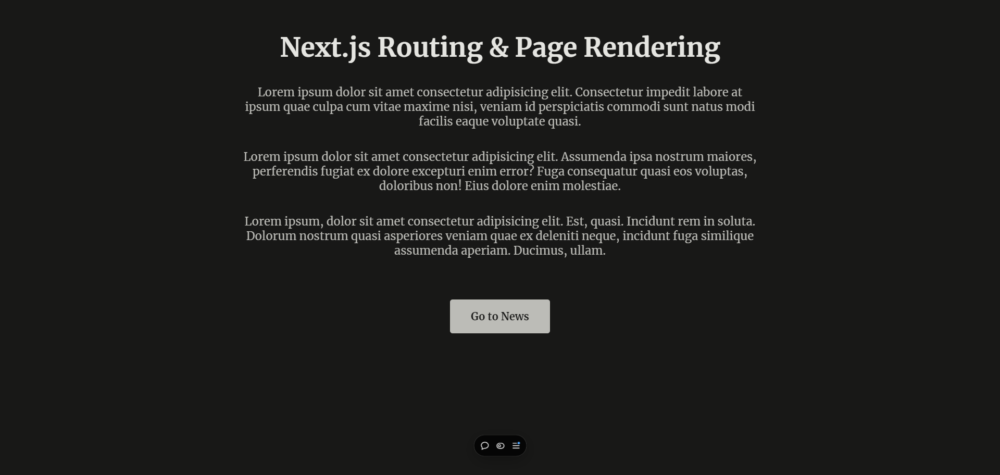
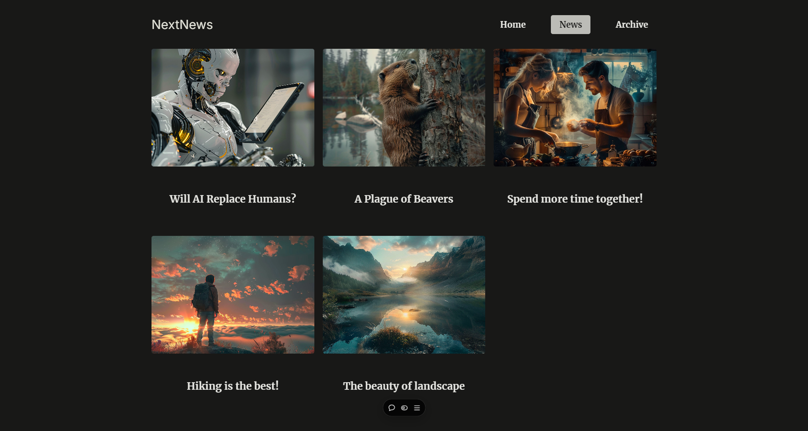
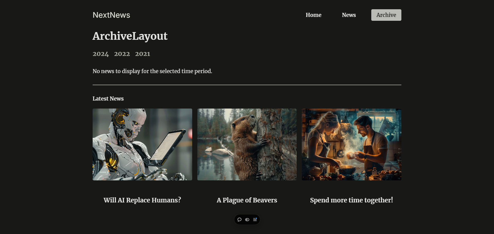
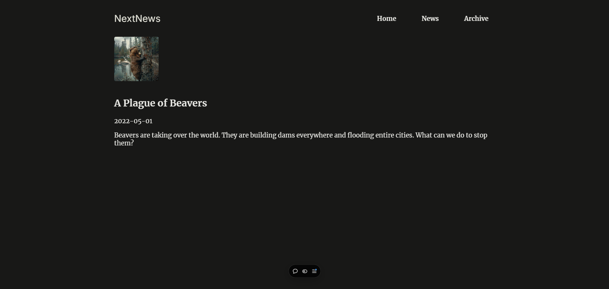
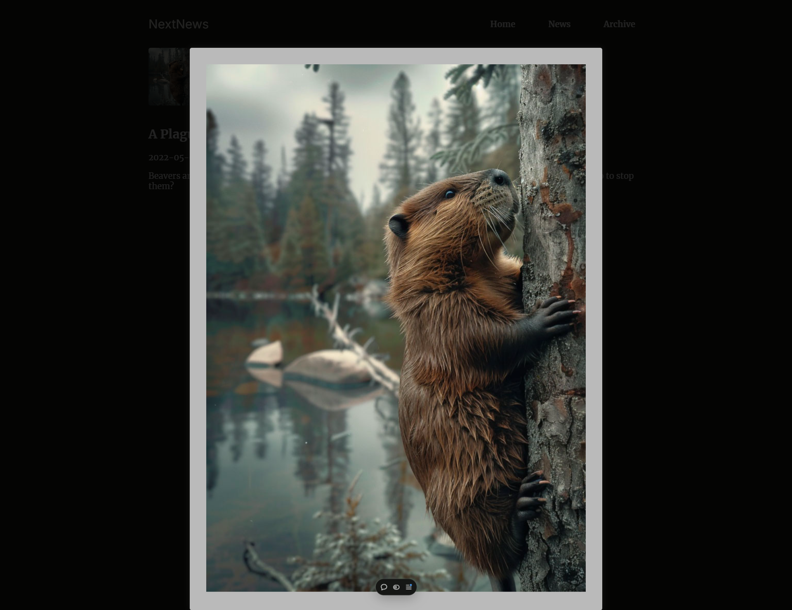

# NextJS News + Archive Project

Developed as a part of training session at [Make Hub](https://makehub.com.bd). This project contains the following:

- Uses dummy json data
- Parallel router
- Interceptor router
- Parallel router and interceptor router mix
- Programmiticaly handling of routing.
- App Router.
- Router group.

## Screenshots

### Home Page

### News Page

### Archive (parallel routing)

### News Details

### Image Preview (Interceptor + Parallel)

